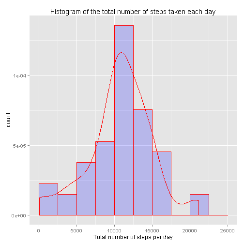

Reproducible Research Assignment 1
================================================================================
####Assumptions
1. lubridate, ggplot2 and lattice package is already installed on the system, if not please download and install them.
  
-------------------------------------------------------------------------------
####Loading and processing the data
  
Here is the code segment for loading and processing the data.
After checking the dataset found that each day is consist of 288 entries or intervals and there are total of 61 days (288 * 61 = 17568)

```r
## load useful packages
library(lubridate)
library(ggplot2)
library(lattice)

## Setup Variable
FileName <- "./repdata_data_activity.zip"
FileURL1 <- "http://d396qusza40orc.cloudfront.net/repdata%2Fdata%2Factivity.zip"
DataFile <- "./activity.csv"

## download necessary files to current working directory if file not present.
if (!file.exists(FileName)){
        download.file(FileURL1, destfile=FileName, mode="wb")
}

## Extract Dataset zip file if not present.
if (!file.exists(DataFile)) {
        unzip(FileName, overwrite=TRUE)
}

## Processing Data
Data <- read.csv(DataFile)
Temp <- formatC(Data$interval, width=4, flag="0")            ## Padding leading 0
Temp1 <- paste(substr(Temp,1,2),":",substr(Temp,3,4),sep="") ## Format to hh:mm
Temp2 <- paste(Data$date," ",Temp1,sep="")                   ## Format to yyyy-mm-dd hh:mm
Data$date1 <- ymd_hm(Temp2)                                  ## Put in POSIXct date format
```
  
#### 1. What is mean total number of steps taken per day?
Here is the code to draw the histogram, please ignore the warning due to NA values.

```r
## Calculate the total number of steps taken per day
D1 <- aggregate(Data$steps, list(Data$date), sum)

## Ogiginal Code using qplot but found using ggplot is better
##qplot(D1$x,
##      geom="histogram",
##      main="Histogram of the total number of steps taken each day",
##      xlab="Total number of steps per day",
##      fill=I("blue"),
##      col=I("red"),
##      alpha=I(.2),
##      ylim=c(0,10))

## Draw the histogram using ggplot2 package
## The qplot produce the same result as ggplot, except the y axis is frequency
## when using ggplot I can add a density trend curve so decided to use ggplot
ggplot(data=D1, aes(D1$x)) +
        geom_histogram(aes(y=..density..),
                       ##breaks=seq(0, 22500, by=1000)
                       breaks=seq(0, 25000, by=2500),
                       col="red",
                       fill="blue",
                       alpha=.2) +
        geom_density(col=2) +
        labs(title="Histogram of the total number of steps taken each day") +
        labs(x="Total number of steps per day", y="count")
```

```
## Warning: Removed 8 rows containing non-finite values (stat_density).
```

 

```r
## Calculate mean and median for reporting
CalMean <- as.character(mean(D1$x, na.rm=TRUE))
CalMedian <- as.character(median(D1$x, na.rm=TRUE))
```
The mean is 10766.1886792453 and the median is 10765 for the total number of steps taken per day.

#### 2. What is the average daily activity pattern?
Here is the code that calculate and genereate the Average Daily Activity Graph

```r
## Calculate the average daily activity for all intervals across all days
D2 <- aggregate(Data$steps, list(Data$interval), mean, na.rm=TRUE)
D2$interval <- D2$Group.1
Temp <- formatC(D2$Group.1, width=4, flag="0")               ## padding leading 0 
Temp1 <- paste(substr(Temp,1,2),":",substr(Temp,3,4),sep="") ## format to hh:mm
Temp2 <- paste("2013-01-01"," ",Temp1,sep="")   ## format to yyyy-mm-dd hh:mm, just set a arbitary date
D2$Group.1 <- ymd_hm(Temp2)                                  ## Change to POSIXct date format

##graph the result using base graphic system plot 
plot(D2$Group.1, D2$x, type="l", col="red", 
     xlab="Time of Day / Intervals", ylab="Average Steps", 
     main="Average Daily Activity")
```

 

```r
## Calculate 5-min interval max for reporting
MaxInterval <- D2$interval[which.max(D2$x)]
Time <- Temp1[which.max(D2$x)]
```
So according to the graph and computation, on average the maximum number of steps 
occured in interval 835 which is 08:35 in the morning.


#### 3. Imputing missing values

```r
## Calculating total number rows of NA for reporting
RowNA <- sum(is.na(Data$steps))
Interval <- 24 * 60 / 5
Days <- RowNA / Interval
```
There are total of 2304 rows with NA's and since each interval is 5 mins
which makes 288 intervals in a day and 8 days worth of NA values. 

I will use the average daily activity value to fill in the NA for each interval
of those 8 days, i.e fill in average daily activity's interval 0 value for all 8 
day's interval 0, fill in average daily activity's interval 5 for all 8 day's 
interval 5 and vise versa until interval 2355 is filled for those 8 days.

below is the code segment that fills in the NA and graphs the
histogram with NA values filled.

```r
## Using the average daily activity value to fill in the NA for the 8 days
Data2 <- Data                   ## create new data set for fill in 
A <- which(is.na(Data2$steps))  ## index of all NA
B <- which(Data2$interval==0)   ## index of interval 0
C <- B %in% A                   ## check interval 0 index in NA index list 
D <- B[C]-1                     ## found all 8 day beginning index
for (i in D){                   ## Using for loop to fill NA with average daily activity's value
        for (j in 1:288){
                Data2$steps[i+j] <- D2$x[j]
        }
}

## Calculate the total number of steps taken per day with NA filled in
D3 <- aggregate(Data2$steps, list(Data2$date), sum)

## Graph histogram using ggplot2 package
ggplot(data=D3, aes(D3$x)) +
        geom_histogram(aes(y=..density..),
                       breaks=seq(0, 25000, by=2500),
                       col="red",
                       fill="blue",
                       alpha=.2) +
        geom_density(col=2) +
        labs(title="Histogram of the total number of steps taken each day") +
        labs(x="Total number of steps per day", y="count")
```

 

```r
## Compute Mean and Median again for reporting
CalMean2 <- as.character(mean(D3$x))
CalMedian2 <- as.character(median(D3$x))
```
The mean is 10766.1886792453 and the median is 10766.1886792453 for the total number of steps taken per day after the missing values are imputed.


#### 4. Are there differences in activity patterns between weekdays and weekends?

```r
## using wday from lubridate package to get the neumerical value of day of the 
## week then using that to form levels and create a factor column in Data2
## where the NA values in steps column are already filled from previous exercise.
weekend <- c(1,7) ## 1 is Sunday, 7 is Saturday
Data2$WDay <- factor((wday(Data2$date1) %in% weekend), 
                     levels=c(TRUE, FALSE), labels=c('weekend', 'weekday'))

## using formula method in aggregate to calculate the average for weekend and 
## weeday for every interval across all days. for detail usage see help.
D4 <- aggregate(steps ~ WDay + interval, Data2, mean)

## Draw the time series plot using lattice package
xyplot(D4$steps~D4$interval|D4$WDay, Data=D4, type="l", 
       main="Average Daily Activity (Weekday vs weekend)", 
       xlab="Interval", ylab="Average Steps", layout=c(1,2))
```

 

Yes, there are some difference in activity patterns according to the graph, for
example there are less activity between 5:30~10:00am during the weekend than
weekday plus some other discrepancy.
